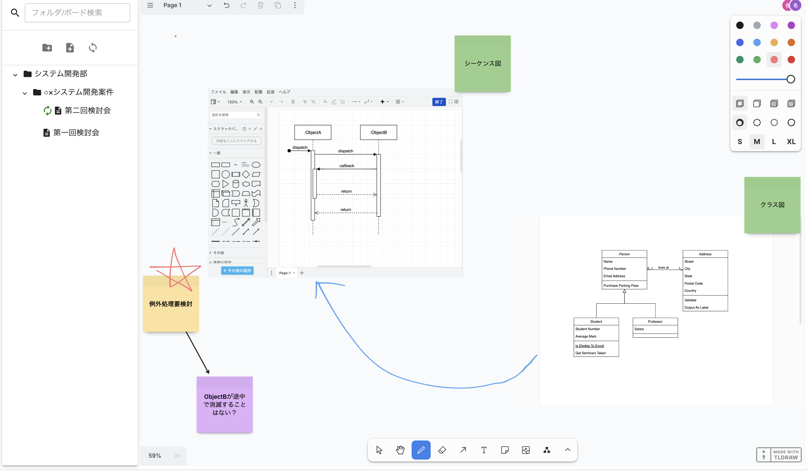

# ホワイトボードアプリ

## 概要

本アプリケーションはリアルタイムで複数人が同時編集できるホワイトボードアプリケーションです。
[tldraw](https://tldraw.dev/) を拡張して、作成しています。

tldrawが提供する付箋等の豊富な作図機能に加えて、draw.ioにて柔軟にUML図等を作図することができるため、システム開発時などに最適です。



## 主な機能

- **ホワイトボード機能**: tldrawが提供する豊富な作図機能を利用可能。
- **リアルタイムの同時編集**: 複数ユーザーが同時にホワイトボードを編集可能。
- **Draw.io の統合**: ホワイトボードに作図ツールとして Draw.io を利用可能
- **フォルダ管理**: 複数のホワイトボードをフォルダに整理可能。※最大 2 階層まで対応。

## 使用技術

- **フロントエンド**: React, Next.js, tldraw
- **バックエンド**: Fastify, TypeORM

## インストールとセットアップ

### 必要条件

- Node.js (v18 以上推奨)
- Yarn

### 利用方法

```bash

# 依存関係をインストール
yarn install

# 開発サーバの起動
yarn dev

# 本番ビルド
yarn build
yarn start

```
